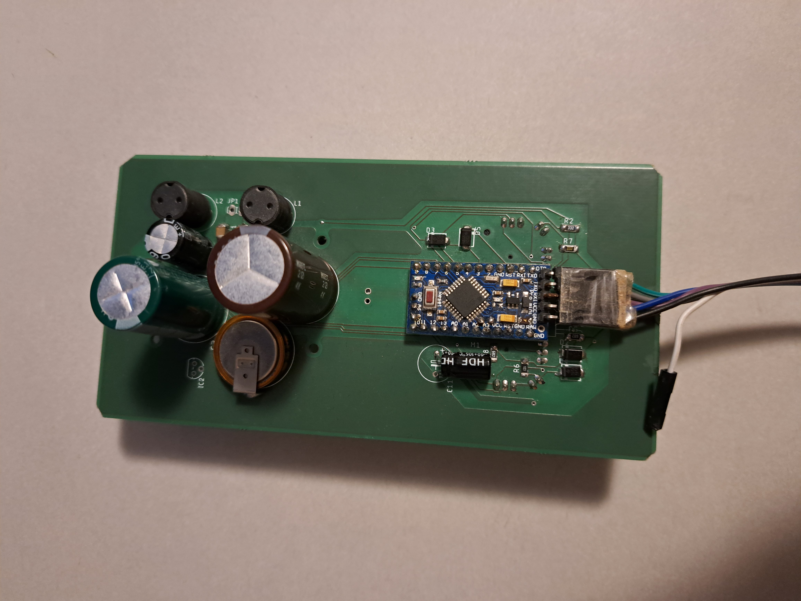

# switch-lamps

## Hardware

### Lamps

Communication over a serial connection.

- One long wall with lamps
  - 4 zones
  - one warm and one cold led strip per zone
- 3 table lamps
- ceiling lamps
- a few floor lamps
- possibly more lamps in the future

### Inputs

- Slide up/down/left/right
- Press up/down/left/right
- Rotate left/right
- a proximity sensor

Sliding always also presses the corresponding button,
so sliding has to overwrite pressing.

### Outputs

- a Waveshare 1.54" e-paper display
- the lamps, obviously

PCB design in `hardware/`.

## The Goal

- Making it possible to control all lamps from one place
- Making multiple switches work together (no state stored on the switch unit)
- Needs to be foolproof
- Adding new lamps should be reasonably easy

## current state

  
   

